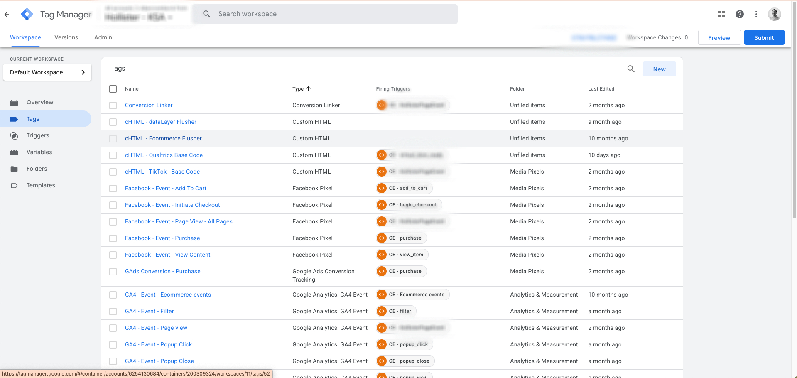
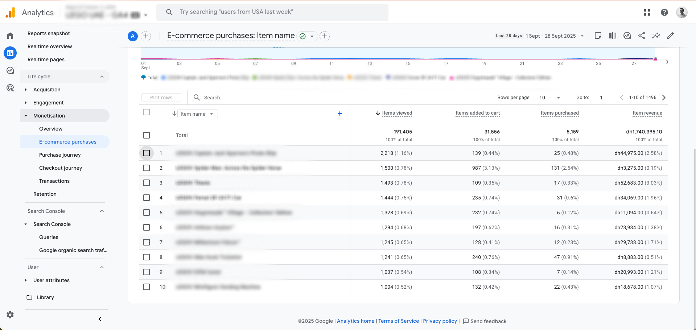
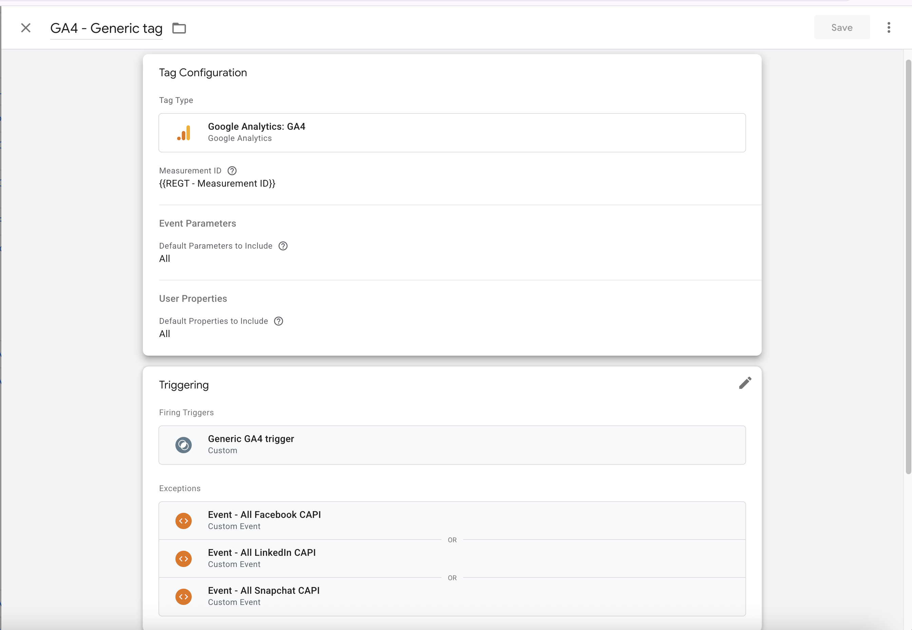
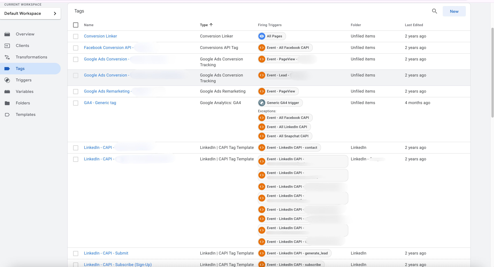

# Data Analytics Consultant | Measurement Specialist | Goolge CLoud Associate Data Practitioner

  

  

## About Me

I'm a **Data Analytics Consultant** specializing in helping businesses accurately measure website and app interactions through tag management and cloud data solutions. I've delivered end-to-end tracking for **50+ enterprise clients**, managing setups with up to **200 tags per property**, and built automation tools that save **10+ hours per project**.

I transform raw data into actionable insights — from implementing GA4 and Firebase SDK on iOS/Android apps to building real-time event pipelines on Google Cloud Platform.

|  50+ Enterprise Clients |  100+ Pixels Implemented |  50+ Conversion APIs |  10+ Tagging Audits Completed |
|:---:|:---:|:---:|:---:|
| Complex tagging ecosystems | Cross-platform ad tracking | Server-side CAPI integrations | 50+ issues identified per audit |

---

## Core Technologies & Tools

<b>Tag Management & Analytics</b>

 

**Tag Management Systems:**

  &nbsp;&nbsp;&nbsp;&nbsp;&nbsp;
  &nbsp;&nbsp;&nbsp;&nbsp;&nbsp;
  

**Analytics Tools:**

  &nbsp;&nbsp;&nbsp;&nbsp;&nbsp;
  &nbsp;&nbsp;&nbsp;&nbsp;&nbsp;
  

 

| Tool | Primary Use Cases |
|------|-------------------|
| **Google Tag Manager** | Tag implementation, event tracking, conversion setup, custom templates |
| **Tealium IQ** | Enterprise tag management, data layer optimization, audience building |
| **Firebase Analytics SDK** | iOS & Android app analytics, real-time data, user properties, BigQuery export |
| **Google Analytics 4** | E-commerce tracking, custom dimensions/metrics, cross-platform reporting |
| **Hotjar** | Heatmaps, session recordings, conversion funnel analysis |
| **Google Search Console** | SEO performance tracking, search analytics |

<b>☁️ Google Cloud Platform</b>

 

  &nbsp;&nbsp;&nbsp;&nbsp;&nbsp;
  &nbsp;&nbsp;&nbsp;&nbsp;&nbsp;
  &nbsp;&nbsp;&nbsp;&nbsp;&nbsp;
  

 

| Service | Use Case |
|---------|----------|
| **BigQuery** | Raw data warehousing, cross-platform analytics, Firebase SDK export analysis |
| **Cloud Run** | Serverless server-side tagging, event ingestion backends |
| **Pub/Sub** | Real-time event streaming from web & app sources |
| **Dataflow + Apache Beam** | ETL streaming pipelines for analytics data transformation |

<b>Frontend Development</b>

  &nbsp;&nbsp;&nbsp;
  &nbsp;&nbsp;&nbsp;
  

**Skills:** Custom event handling, DOM manipulation, API integrations, performance optimization, Google Apps Script automation

**Impact:** Built 3 automation tools and 1 reusable GTM template that collectively save **10+ hours per project** — adopted team-wide for standardized deployments

---

## Measurement & Analytics Phases

<b>Phase 1: Discovery & Strategy</b>

 

- **Current Tracking Setup Assessment**: Complete audit of existing tracking — 10+ audits delivered, each identifying 50+ issues
- **Gap Analysis**: Identification of missing data points across web and app
- **KPI Mapping**: Alignment with business objectives
- **Technical Specification**: Detailed implementation plan
- **Timeline & Milestones**: Clear project roadmap

<b>Phase 2: Implementation</b>

 

- **Tag Management Setup**: GTM/Tealium configuration across 50+ enterprise properties
- **Data Layer Development**: Custom event tracking for web and mobile
- **Analytics Configuration**: GA4 and Firebase SDK setup, BigQuery export pipelines
- **App Measurement**: Firebase SDK integration for iOS and Android with event schema design
- **DataLayer Implementation Guide**: Auto-generated developer guides via Apps Script automation

<b>Phase 3: Testing & Validation</b>

 

- **Data Accuracy Testing**: Tracking validations and QA reports
- **Cross-Browser Testing**: Compatibility across devices and platforms
- **Discrepancy Analysis**: Reducing gaps between GA4, ad platforms, and backend data to 2–5%
- **Team Training**: Team enablement sessions

<b>Phase 4: Optimization & Support</b>

 

- **Performance Monitoring**: Ongoing data quality checks
- **Server-Side Scaling**: Cloud Run infrastructure tuned to event volume
- **Team Training**: Skill transfer and best practices

---

## Featured Projects & Business Outcomes

### E-commerce Analytics Implementation
**Client:** Major Online Retailer

  
  
<em>Google Tag Manager Configurations</em>

  
  
<em>Google Analytics 4 "E-commerce Purchases"</em>

**Challenge → Solution → Result**

| Challenge | Solution | Result |
|-----------|----------|---------|
| No visibility into e-commerce funnel & user journey | GTM & DataLayer implementation for GA4 tracking | Full e-commerce funnel visibility with drop-off analysis |
| No item performance tracking | Enhanced e-commerce events with product-level parameters | Item-level insights across ID, name, category, price & quantity |
| No conversion tracking in Meta ad platforms | Media pixels via GTM for cross-platform optimization | Conversions sent to ad platforms to optimize ROAS |

<b>🔧 Technical Implementation Details</b>

 

- **GTM & DataLayer Setup**: Comprehensive e-commerce event tracking implementation
- **GA4 E-commerce Events**: `purchase`, `add_to_cart`, `begin_checkout`, `view_item` with full item-level parameters
- **Item-Level Tracking**: Product ID, name, category, price, quantity parameters
- **Media Pixels Integration**: Facebook Pixel, TikTok Pixel, Google Ads via GTM

---

### Website Conversion Tracking
**Client:** Lead Vehicle Dealership

  
  
<em>Google Tag Manager Configurations</em>

  
  
<em>Google Analytics 4 Dashboard</em>

  
  
<em>Pixels Implementation</em>

**Challenge → Solution → Result**

| Challenge | Solution | Result |
|-----------|----------|---------|
| High form abandonment rate & no lead tracking | GTM & DataLayer for form events & user journey optimization | Visibility on drop-off points across every form step |
| Incorrect marketing attributions | Custom channel grouping configurations in GA4 | Clear performance breakdown across all marketing channels |
| No conversion tracking in TikTok ad platforms | Media pixels via GTM for campaign optimization | Conversions sent to TikTok to optimize ad spend |

<b>Technical Implementation Details</b>

 

- **GTM & DataLayer Implementation**: Form interaction and submission event tracking
- **Form Events Tracking**: `form_start`, `form_submit`, `form_abandon` with field-level data
- **User Journey Optimization**: Step-by-step form analytics and abandonment points
- **GA4 Channel Groups Configuration**: Custom channel grouping for accurate attribution
- **Media Pixel Integrations**: Conversion tracking and campaign optimization via GTM

---

### Server-Side Tagging & Conversion API (CAPI)

  
  
<em>Server-side Google Tag Manager</em>

  
  
<em>Conversion API Implementation (CAPI)</em>

**Challenge → Solution → Result**

| Challenge | Solution | Result |
|-----------|----------|---------|
| Data loss from ad blockers & cookie limitations | GTM Server-side tagging on Cloud Run serverless instance | Mitigated ad blocker impact and browser constraints |
| Discrepancy between GA4, ad platforms & backend | First-party context tracking to bypass browser constraints | Reduced discrepancies to 2–5% across platforms |
| Inaccurate conversion data to ad platforms | Conversion API (CAPI) for direct server-to-server tracking | More accurate conversion data powering ad optimization |

<b>Technical Implementation Details</b>

 

- **GTM Server-Side Tagging**: Cloud Run serverless instance for first-party data collection
- **50+ CAPI Integrations**: Meta, TikTok, Google Ads server-side conversion APIs deployed across clients
- **500+ Pixels Managed**: Client-side pixel deployments orchestrated through GTM
- **First-Party Context Tracking**: Bypassing ad blockers and browser privacy constraints

---

### Real-Time Event Streaming Pipeline
**Personal GCP Project**

**Challenge → Solution → Result**

| Challenge | Solution | Result |
|-----------|----------|---------|
| Need for real-time web analytics beyond GA4 | Cloud Run backend → Pub/Sub → Dataflow ETL → BigQuery | End-to-end streaming pipeline with sub-second latency |
| Raw data needed for ML model training | Apache Beam pipeline writing structured events to BigQuery | Data ready for Vertex AI models and Looker dashboards |
| Cost-efficient architecture at scale | Infrastructure designed around projected event volume | Optimized GCP spend with serverless components |

<b>Technical Implementation Details</b>

 

- **Cloud Run Backend**: Receives and reformats JSON event payloads from the frontend
- **Pub/Sub Topic**: Publishes processed events as messages for downstream consumers
- **Dataflow + Apache Beam (Python)**: Streaming ETL pipeline that parses, transforms, and loads events into BigQuery
- **BigQuery**: Schema-validated tables serving Vertex AI and Looker Studio

---

### GTM/GA4 Configuration Automation Platform
**Internal Tool — Adopted Across Analytics Team**

**Challenge → Solution → Result**

| Challenge | Solution | Result |
|-----------|----------|---------|
| Manual GTM/GA4 setup was time-consuming and error-prone | Web app integrating GTM and GA4 Admin APIs for automated configuration | 10+ configurations automated, saving 10+ hours per project |
| No standardized deployment workflow across the team | Pre-built templates + CSV upload input methods | Tool adopted team-wide for consistent, repeatable deployments |
| API quota limits threatened reliability | Built-in rate limiting logic for batch operations | Stable, reliable automation within API constraints |

<b>Technical Implementation Details</b>

 

- **GTM API**: Automates tag, trigger, and variable configuration at scale
- **GA4 Admin API**: Creates custom dimensions and metrics dynamically from user input
- **Input Methods**: CSV upload and pre-built template options for flexible workflows
- **Rate Limiting**: Quota-safe batch processing for reliable large-scale deployments

---

## 🏆 Credentials and Certifications

|  |  |  |  |  |
|:---:|:---:|:---:|:---:|:---:|
| **Google Analytics 4 Certified** | **Google Cloud Associate Data Practitioner** | **Tealium IQ Certified** | **Hotjar Certified** | **SEO Certified** |

 

*Click any badge to view the full certificate*

---

### Let's Connect

&nbsp;&nbsp;

