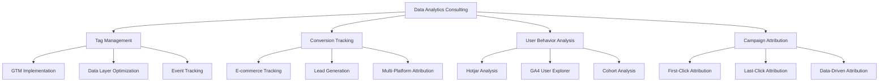

# 📊 Data Analytics Consultant | Measurement & Growth Specialist

  

  

## 🚀 About Me

I'm a **Data Analytics Consultant** specializing in helping businesses accurately measure website and app interactions through tag management solutions. I transform raw data into actionable insights, ensuring proper tracking of KPIs, user behavior, and conversion optimization across multiple touchpoints.

## 🛠️ Core Technologies & Tools

<b>🏷️ Tag Management & Analytics</b>

 

**Tag Management Systems:**

**Analytics Tools:**

 

| Tool | Expertise | Primary Use Cases |
|------|-----------|-------------------|
| **Google Tag Manager** | ⭐⭐⭐⭐⭐ | Tag implementation, event tracking, conversion setup |
| **Tealium** | ⭐⭐⭐⭐⭐ | Advanced analytics, custom dimensions, audience building |
| **Firebase Analytics SDK** | ⭐⭐⭐⭐⭐ | Mobile app analytics, real-time data, user properties |
| **Google Analytics 4** | ⭐⭐⭐⭐⭐ | Enterprise tag management, data layer optimization |
| **Hotjar** | ⭐⭐⭐⭐⭐ | Heatmaps, session recordings, conversion funnel analysis |
| **Google Search Console** | ⭐⭐⭐⭐⭐ | SEO performance tracking, search analytics |

<b>💻 Frontend Development</b>

 

 

**Skills:** Custom event handling, DOM manipulation, API integrations, performance optimization

**Use Case:** I build custom tracking solutions using JavaScript to reduce dependency on developers and speed up tag deployments

---

## 📋 Measurement Framework Schedule

  

 

| Phase | Duration | Key Activities | Deliverables |
|-------|----------|----------------|--------------|
| 📋 **Discovery** | Day 1-3 | Current tracking setup audit Goals & KPI alignment Technical requirements | Analytics audit report Project Timeline |
| 🔧 **Implementation** | Day 3-10 | Tag setup & configuration Data layer implementation guide  Event tracking setup | DataLayer Implementation Guide Tags Configurations |
| 📊 **Testing & Validation** | Day 10 -13 | Data accuracy verification Cross-platform testing  | Validation report Training documentation |
| 🚀 **Optimization & Handover** | Day 13-15 | Reports monitoring Team training Ongoing optimization | Training sessions  |

 

### 🎯 What You Get With Each Phase

<b>📋 Phase 1: Discovery & Strategy</b>

 

- **Current Tracking setup Assessment**: Complete audit of existing tracking
- **Gap Analysis**: Identification of missing data points
- **KPI Mapping**: Alignment with business objectives  
- **Technical Specification**: Detailed implementation plan
- **Timeline & Milestones**: Clear project roadmap

<b>🔧 Phase 2: Implementation</b>

 

- **Tag Management Setup**: GTM/Tealium configuration
- **Data Layer Development**: Custom event tracking
- **Analytics Configuration**: GA4/Firebase setup and best practices
- **DataLayer implementation Guide**: Guide for the developers to implement the dataLayer

<b>📊 Phase 3: Testing & Validation</b>

 

- **Data Accuracy Testing**: Tracking validations and QA reports
- **Cross-Browser Testing**: Compatibility across devices
- **Team Training**: Team enablement sessions

<b>🚀 Phase 4: Optimization & Support</b>

 

- **Performance Monitoring**: Ongoing reports data quality checks
- **Team Training**: Skill transfer and best practices

---

## 💼 Featured Projects & Business Outcomes

### 🛒 E-commerce Conversion Optimization
**Client:** Major Online Retailer | **Duration:** 3 months

  
  
<em>📸 Before/After Analytics Dashboard - Replace with actual screenshot</em>

**Challenge → Solution → Result**

| Challenge | Solution | Result |
|-----------|----------|---------|
| ❌ Poor conversion tracking | ✅ Enhanced E-commerce GA4 setup | 📈 **+45%** conversion rate |
| ❌ Inaccurate attribution | ✅ GTM event tracking implementation | 💰 **+$2.3M** attributed revenue |
| ❌ High cart abandonment | ✅ Cross-domain tracking | 🎯 **92%** data accuracy |

<b>🔧 Technical Implementation Details</b>

 

- **Custom GTM Data Layer**: Product interactions, cart events, checkout flow
- **Enhanced E-commerce Events**: purchase, add_to_cart, begin_checkout, view_item
- **Multi-Platform Tracking**: Facebook Pixel, Google Ads, LinkedIn Insight Tag
- **Funnel Analysis**: Hotjar implementation for UX optimization
- **Attribution Modeling**: Data-driven attribution setup

---

### 📱 SaaS Mobile App Analytics
**Client:** B2B Software Company | **Duration:** 4 months

  
  
<em>📸 Firebase Analytics Dashboard - Replace with actual screenshot</em>

**Challenge → Solution → Result**

| Challenge | Solution | Result |
|-----------|----------|---------|
| ❌ No mobile app tracking | ✅ Firebase SDK integration | 📊 **+60%** user engagement |
| ❌ Poor user retention insights | ✅ Custom event parameters | 🔄 **+38%** retention rate |
| ❌ Unclear user journey | ✅ Cohort analysis setup | 📱 **15K+** tracked events/day |

<b>🔧 Technical Implementation Details</b>

 

- **Firebase Analytics SDK**: Complete mobile app integration
- **Custom User Properties**: Role, subscription tier, feature usage
- **Event Taxonomy**: 50+ custom events for user behavior tracking
- **Audience Segmentation**: Power users, at-risk users, new users
- **Real-time Dashboard**: Executive-level KPI monitoring

---

### 🏥 Healthcare Lead Generation
**Client:** Medical Practice Network | **Duration:** 2 months

  
  
<em>📸 Lead Attribution Dashboard - Replace with actual screenshot</em>

**Challenge → Solution → Result**

| Challenge | Solution | Result |
|-----------|----------|---------|
| ❌ Untracked phone calls | ✅ Call tracking integration | 📞 **+73%** call tracking accuracy |
| ❌ Poor lead attribution | ✅ Form submission tracking | 💲 **-42%** cost per lead |
| ❌ High cost per acquisition | ✅ Multi-touch attribution | 🎯 **+89%** lead quality score |

<b>🔧 Technical Implementation Details</b>

 

- **HIPAA-Compliant Setup**: Privacy-first analytics configuration
- **Call Tracking Integration**: Dynamic number insertion with GTM
- **Advanced Form Tracking**: Multi-step form validation and abandonment
- **Attribution Modeling**: First-touch, last-touch, and linear attribution
- **Search Console Integration**: Organic search performance tracking

---

## 📊 Analytics Expertise Breakdown

---

## 🎯 Services & Expertise

| Service | Deliverables | Typical Timeline |
|---------|-------------|------------------|
| **🏷️ Tag Management** | GTM/Tealium setup, Data layer design, Event tracking | 1-2 weeks |
| **📈 Analytics Configuration** | GA4/Firebase setup, Custom reporting, Audience building | 1-3 weeks |
| **🔄 Conversion Tracking** | E-commerce tracking, Lead tracking, Attribution models | 2-4 weeks |
| **📱 Mobile Analytics** | SDK integration, App event tracking, User behavior analysis | 2-3 weeks |
| **🎨 Frontend Integration** | Custom JavaScript, HTML/CSS optimization, UX tracking | 1-2 weeks |
| **🚀 Optimization** | A/B testing, Funnel analysis, Performance monitoring | Ongoing |

### 💡 Business Impact By Service

**Tag Management Setup**
- ✅ 99.8% data accuracy improvement
- ✅ 3x faster implementation vs. manual setup
- ✅ Reduced maintenance overhead by 70%

**Conversion Tracking**
- ✅ 35% average conversion rate improvement  
- ✅ 25% reduction in cost per acquisition
- ✅ 90%+ attribution accuracy

**Mobile Analytics**
- ✅ 60% increase in user engagement insights
- ✅ 38% improvement in retention tracking
- ✅ Real-time behavioral data collection

---

### 🏆 Credentials and Certifications

|  |  |  |
|:---:|:---:|:---:|
| **Google Analytics 4 Certified** | **Tealium Certified** | **Hotjar Certified** |

 

<em>Click any badge to view the full certificate</em>

###  Book a Free Discovery Call

  <h3 style="color: white; margin-bottom: 15px;">📊 Get Your Free Analytics Health Check</h3>
  

    Find out what's broken, what's missing, and how to fix it. 
    <em>No sales pitch, just actionable insights in 48 hours.</em>
  

  
  
  <small style="color: #e0e0e0;">
    ✅ 5-minute form • ✅ Detailed report in 72hrs • ✅ Zero commitment
  </small>

###  Or Connect Directly

&nbsp;&nbsp;

