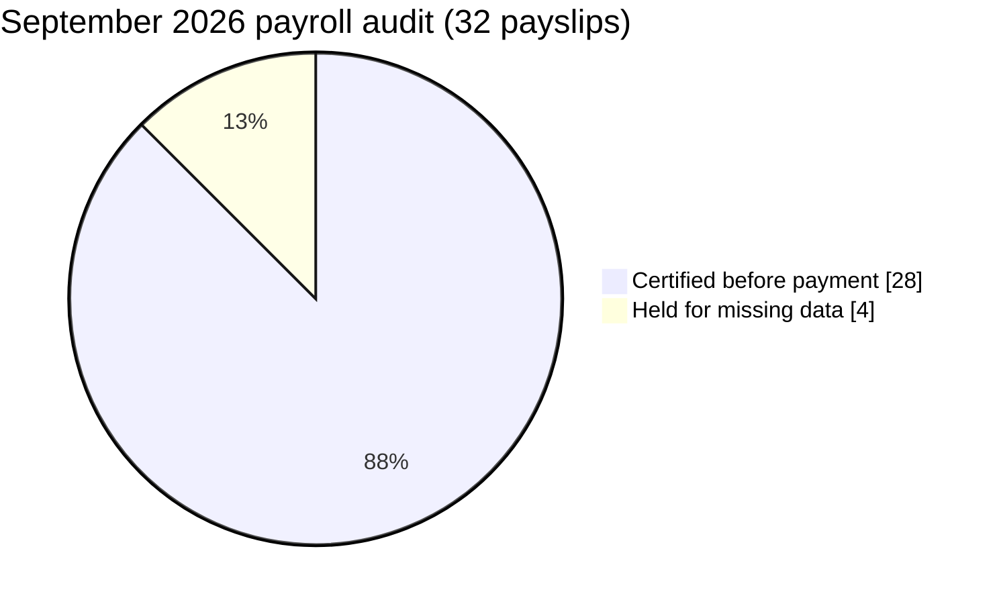
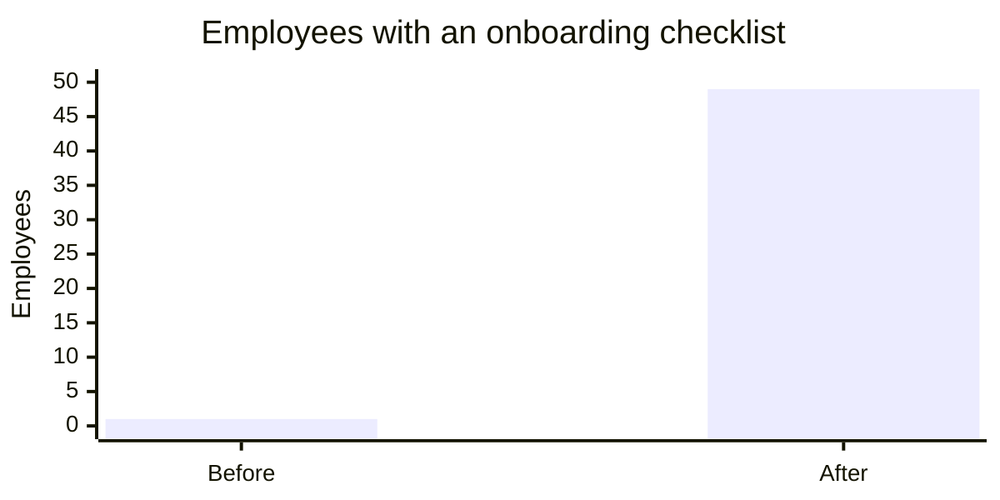
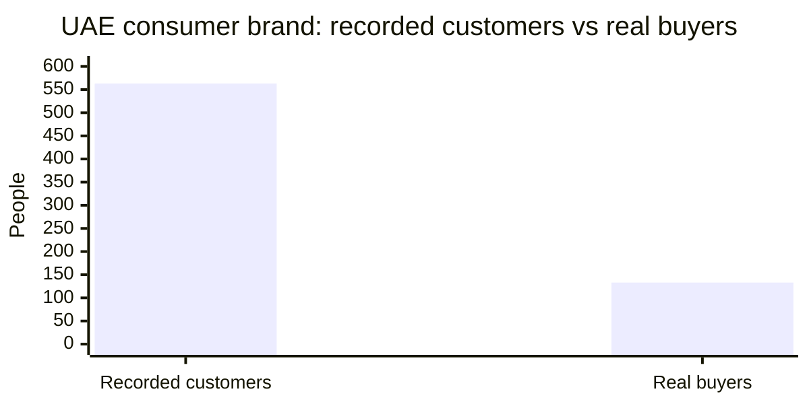
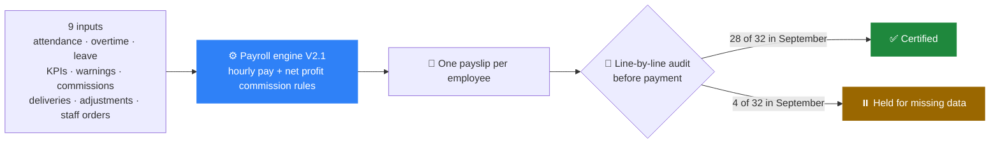
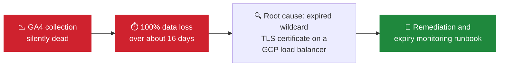
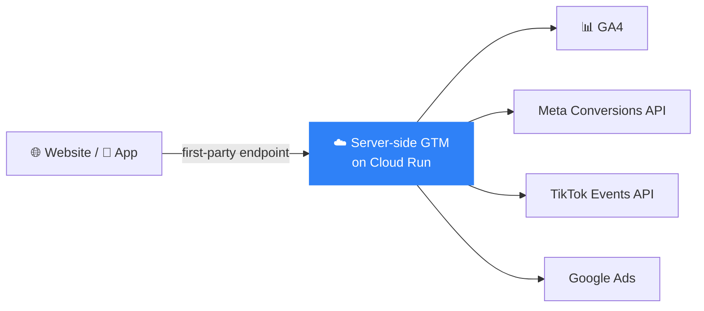
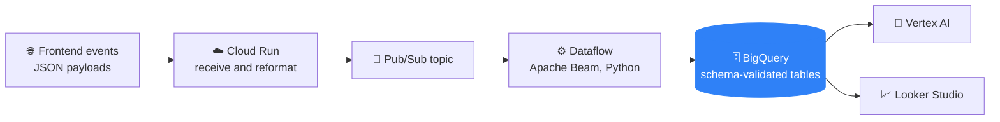

<!--
  GitHub profile README, updated October 2026
  Before publishing: find and replace YOUR_GITHUB_USERNAME with your GitHub handle.
  It is used by the profile views badge and the GitHub Activity section.
-->

  

  

  
  
  
  

  

---

## 👋 About Me

I'm a **Data Analytics Consultant** specializing in helping businesses accurately measure website and app interactions through tag management and cloud data solutions. I've delivered end-to-end tracking for **50+ enterprise clients**, managing setups with up to **200 tags per property**, and built automation tools that save **10+ hours per project**.

I transform raw data into actionable insights, from implementing GTM/GA4 and Firebase SDK on iOS/Android apps to building real-time event pipelines on Google Cloud Platform.

Since **April 2026** I also run technology at **The Reel Recipe** as Innovation Manager (tech lead), and I'm co-founder and CTO of **Rewired**, the software company behind **Reivo**, **Click**, and **Rawaj**.

### 🧭 Where I Work Now

<table>
  <tr>
    <td width="33%" align="center" valign="top">
      <h3>📐 Merkle (dentsu)</h3>
      <b>Data &amp; Analytics Consultant</b>
        
      Measurement for enterprise clients across GA4, server-side GTM, Adjust, BigQuery, and Looker
    </td>
    <td width="33%" align="center" valign="top">
      <h3>🎬 The Reel Recipe</h3>
      <b>Innovation Manager (tech lead)</b>
        
      Since April 2026. Leading a 5-person team across internal systems, client analytics, and product
    </td>
    <td width="33%" align="center" valign="top">
      <h3>🚀 Rewired</h3>
      <b>Co-founder &amp; CTO</b>
        
      The software company behind Reivo, Click, and Rawaj
    </td>
  </tr>
</table>

---

## 📈 Impact at a Glance

<table>
  <tr>
    <td align="center" width="25%"><h3>50+</h3>enterprise clients tracked end to end</td>
    <td align="center" width="25%"><h3>100+</h3>ad pixels implemented</td>
    <td align="center" width="25%"><h3>50+</h3>server-side Conversion APIs</td>
    <td align="center" width="25%"><h3>10+</h3>tagging audits, 50+ issues found in each</td>
  </tr>
  <tr>
    <td align="center"><h3>5</h3>people on the tech team I lead</td>
    <td align="center"><h3>7</h3>production Airtable bases I run</td>
    <td align="center"><h3>30+</h3>employees paid monthly through the payroll I rebuilt</td>
    <td align="center"><h3>194</h3>test cases written for a SaaS product we built</td>
  </tr>
  <tr>
    <td align="center"><h3>100</h3>leads from one product launch video</td>
    <td align="center"><h3>24</h3>client portal access seats recovered</td>
    <td align="center"><h3>16 days</h3>of fully lost analytics data traced to root cause</td>
    <td align="center"><h3>7</h3>GA4 properties reconciled across 4 online stores</td>
  </tr>
</table>
Client names are withheld. Figures come from production data, audits, and delivered work.

---

## 📊 Impact, Visualized

```mermaid
pie showData
    title September 2026 payroll audit (32 payslips)
    "Certified before payment" : 28
    "Held for missing data" : 4
```

Monthly line-by-line verification before any money moves.

```mermaid
%%{init: {"xyChart": {"width": 600, "height": 300}}}%%
xychart-beta
    title "Employees with an onboarding checklist"
    x-axis ["Before", "After"]
    y-axis "Employees" 0 --> 50
    bar [1, 49]
```

392 checklist rows across all 49 active employees, with 8 checks that tick themselves from live HR data.

```mermaid
%%{init: {"xyChart": {"width": 600, "height": 300}}}%%
xychart-beta
    title "UAE consumer brand: recorded customers vs real buyers"
    x-axis ["Recorded customers", "Real buyers"]
    y-axis "People" 0 --> 600
    bar [563, 133]
```

431 of 563 recorded "customers" had never bought, and one internal account carried 16.7% of revenue. The base was rebuilt before any targeting decision.

---

## 🎬 The Reel Recipe · Innovation Manager (Tech Lead)

  
  
  
  
  

I took over technology in April 2026 and set its scope around four outcomes: **faster workflows through automation, new revenue from digital products, better client delivery, and governed systems.**

- 👥 **Lead a team of 5** across internal systems, client analytics, and product. Work runs as tickets and sprints in a dedicated Innovation base, and every billable hour is logged against a ticket and a project.
- 🔀 **Made engineering reviewable.** Created the company GitHub organization, moved repositories into it, and set a pull request workflow so interns ship through review instead of pushing to main.
- 🎓 **Built intern onboarding around one target:** first solo task within 5 working days, with access provisioning, base safety rules, and a hard gate before anyone gets edit rights.
- 🎤 **Presented the technology plan to the whole company:** a 20-minute talk on reaching the 2026 revenue target through automation, products, and measurement instead of headcount.

### 🔁 Before → After

| Area | Before | After |
|:--|:--|:--|
| 💸 **Payroll** | Needed manual fixes | One engine builds every payslip from 9 inputs, audited line by line before payment |
| 🧾 **Commissions** | Reels filtered and grouped by hand every month | Automated commission lines for content specialists, marketing consultants, and social media managers |
| 🧭 **Onboarding** | 1 of 49 employees had a checklist | All 49, with 8 checks that tick themselves from live HR data |
| 🎯 **KPI scoring** | Covered 2 departments | Weighted scorecards for 6 role families, routed by department and position |
| ✅ **Content cards** | 5 things checked by hand per client | A 13-check gate: cards open only when everything reads "All set" |
| 💳 **Finance** | Payment requests and client payments moved over messages | Forms with accountant approval that create transactions automatically |
| 🔐 **Portal access** | Former clients and staff still held seats | 24 seats freed and an offboarding gap closed |

### ⚙️ How Payroll V2.1 Works

```mermaid
flowchart LR
    IN["9 inputs<br/>attendance · overtime · leave<br/>KPIs · warnings · commissions<br/>deliveries · adjustments · staff orders"] --> ENG["⚙️ Payroll engine V2.1<br/>hourly pay + net profit commission rules"]
    ENG --> SLIP["🧾 One payslip per employee"]
    SLIP --> AUD{"🔎 Line-by-line audit<br/>before payment"}
    AUD -->|"28 of 32 in September"| CERT["✅ Certified"]
    AUD -->|"4 of 32 in September"| HOLD["⏸️ Held for missing data"]
    classDef core fill:#2F81F7,stroke:#2F81F7,color:#FFFFFF
    classDef good fill:#1F883D,stroke:#1F883D,color:#FFFFFF
    classDef wait fill:#9A6700,stroke:#9A6700,color:#FFFFFF
    class ENG core
    class CERT good
    class HOLD wait
```

<b>🔍 System-by-system proof (11 systems)</b>

 

| System | What changed | Proof |
|:--|:--|:--|
| 💸 **Payroll V2.1** | Replaced a payroll that needed manual fixes with one engine that builds every payslip from 9 inputs: attendance, overtime, leave, KPIs, warnings, commissions, deliveries, adjustments, and staff orders. Added hourly pay and net profit commission rules at system level | 8 new tables migrated into production with zero deletions, then a parallel run against the old system before cutover. September: 32 payslips audited line by line, 28 certified before payment, 4 held for missing data |
| 🔎 **Payroll audits** | Monthly verification before any money moves | The August audit caught 4 already approved payslips missing delivery commission, and commission lines attached to the wrong employee, before payment |
| 🕒 **Attendance** | Turned raw fingerprint terminal exports (nicknames, Arabic AM/PM markers, missing IDs) into a validated monthly deduction file loaded straight into payroll | 27-person roster mapped by ID. Device outages and public holidays excused automatically. August deductions verified against 34 payslips |
| 🧾 **Commissions** | Replaced monthly hand filtering and grouping of reels with automated commission lines for content specialists, marketing consultants, and social media managers | 255 reels and 19 client-month lines backfilled for May. Caught a misconfigured rollup that would have paid every specialist zero or overpaid them |
| 🔗 **Delivery to payment linking** | Approved deliveries were not linked to client payments, which broke the commission chain. Built a script that links them on client, month, and service, including instalments | Backtested against 46 manual links. Surfaced a case where two deliveries paid commission on the same payments |
| ✅ **Content card gate** | Managers checked 5 things by hand before opening each client's monthly content cards. Built a 13-check gate so cards only open when everything reads "All set" | 3 duplicate guards and a 60-card safety cap. 20 test cases. A later change verified in a 12-scenario harness with zero logic drift |
| 🧭 **Employee onboarding** | 1 of 49 active employees had an onboarding checklist | 392 checklist rows across all 49 employees, with 8 checks that tick themselves from live HR data |
| 🎯 **KPIs** | Scoring covered 2 departments | Weighted scorecards for 6 role families, routed automatically by department and position. All 33 live records traced through the routing |
| 🌴 **Leave** | Automations were running the wrong rules | The audit found 8 defects, including the wrong weekend in working-day maths and a balance check that only blocked zero balances |
| 💳 **Finance flows** | Payment requests and client payments moved over messages | Request-for-payment and payment-received forms with accountant approval that create transactions automatically |
| 🔐 **Access control** | Former clients and former staff still held client portal seats | Reconciled Cloudflare Zero Trust seats against CRM client status: 24 seats freed, an offboarding gap closed, 2 unknown accounts flagged for security review |

**Also shipped:** an eNPS survey (19 questions, 6 dimensions), a staff ordering system billed through payroll, a content calendar with an 8-page interface, and a sprint and billable hours tracker.

### 🤝 Client Delivery & Data

- 🖥️ **Client review portal** on Cloudflare Workers and Airtable behind Zero Trust login, so clients review work in one place instead of chat threads.
- 📅 **Weekly performance reporting** with Meta and TikTok data pulled automatically through Apps Script and Porter into Looker Studio.
- 🧮 **Customer analysis for a UAE consumer brand:** found that 431 of 563 recorded "customers" had never bought and that one internal account carried 16.7% of revenue. Rebuilt the base to 133 real buyers before any targeting decision, then showed that one city's customers spend 18.4% more per head than the other's.
- 📣 **Paid media audit:** found the highest-return line (retargeting) switched off, and a campaign with 596 clicks and zero landing page views, which pointed to a broken click path.
- 🔗 **UTM system** for an ambassador program: a link builder and naming rules, rebuilt for Google Sheets after 14 dropdowns failed to load.
- 💡 **Content inspiration pipeline** in n8n (yt-dlp, ffmpeg, transcription, LLM enrichment) feeding an ideas library that AI tools can query through its own MCP connector.

---

##  Products I've Built

  
  
  
  

Co-founder and CTO of **Rewired**, the software company behind Reivo, Click, and Rawaj.

| Product | What it is | Proof |
|:--|:--|:--|
| 🎞️ **Reivo** formerly Revio | Multi-tenant client review SaaS for creative agencies: timecoded video comments, approvals, invoices, and contracts in one portal | 8 roles enforced by Postgres row level security, encrypted HLS video on R2, true Arabic RTL, 30 documented workflows. **194 test cases across 14 modules.** Launch video produced **100 leads** |
| 🗃️ **Click** | Relational database product with Airtable import | Ships an MCP server with **24 tools** behind OAuth 2.1, so AI agents can work in customer tables |
| 🤝 **Rawaj** | Marketplace connecting brands with vetted creators, editors, and UGC talent | Engineering spec of **24 phases, about 200 features, and about 300 named tests** written before the build |
| 🏢 **ERP hosting line** | Open source ERP deployed on the client's own cloud | Provider decision matrix priced at 10, 50, and 200 users. Standardized on Frappe/ERPNext |
| 🪪 **ID verification** | One-time national ID and face check for a mobile app, storing no identity data | Designed at about **\$0.044 per user** worst case, under a \$0.05 cap that the first vendor exceeded about 6 times |
| 📱 **App tracking debugger** | My own tool for iOS app tracking QA | Built after commercial proxy tools blocked audits with session limits and paywalls |

---

## 📐 Merkle (dentsu) · Measurement & Analytics

  
  
  
  
  
  

| Client | Problem | What I delivered |
|:--|:--|:--|
| 🏥 **GCC health insurer** iOS and Android | Greenfield mobile measurement with Adjust | Led a 4-person delivery. Mapped 7 media suppliers, designed a **6-bit SKAN 4.0 conversion schema across 25 events**, created the apps, verified iOS, and linked every partner. Corrected the setup order so supplier setup and SDK work run in parallel, and caught a proposed schedule that overstated the timeline by about 50% |
| 🎢 **UAE theme park group** cross-domain booking | Purchases not credited to the campaigns that drove them | Analyzed **319 purchases** and ran a controlled test matrix that ruled out 6 suspected causes. Proved cross-domain tracking works and isolated the real mechanisms: campaigns dropped mid-session, and UTM-tagged internal links restarting sessions. Also found staging sites writing into the production property |
| 🎟️ **Same group** ticket booking flow | No ecommerce data | GA4 ecommerce tracking for 6 events on a Drupal booking flow, plus a **Playwright QA spec that blocks analytics beacons** so testing never pollutes production data |
| 🛍️ **Multi-market retailer** 4 Shopify stores, 7 GA4 properties | UAE showed 28% more GA4 sessions than Shopify, and an internal memo called it unavoidable | Proved checkout stitching works (identical client and session IDs) and removed about a third of the UAE excess with the first fix, while KSA and Kuwait stayed within 4% of Shopify. Rolled fixes out one store at a time |
| 🏛️ **Large public sector site** server-side GTM | GA4 collection silently dead | Traced **100% data loss over about 16 days** to an expired wildcard TLS certificate on a GCP load balancer, and handed the owner a remediation and expiry monitoring runbook |
| 🧹 **GA4 governance** | 41 custom definitions with unknown health | Audit script that classifies each one as dead, stale, quality issue, or healthy |
| 🚗 **Car marketplace** | Unreliable GA4 data | Audit that found dev and staging traffic in the production property and hard-coded tags outside GTM, with fixes ordered to prevent double counting |
| 🏢 **Corporate holding group** | No view of real site navigation | GA4 → BigQuery → Looker dashboard covering navigation, CTA, card, and PDF clicks |

```mermaid
flowchart LR
    A["📉 GA4 collection<br/>silently dead"] --> B["⏱️ 100% data loss<br/>over about 16 days"]
    B --> C["🔍 Root cause: expired wildcard<br/>TLS certificate on a<br/>GCP load balancer"]
    C --> D["📘 Remediation and<br/>expiry monitoring runbook"]
    classDef bad fill:#CF222E,stroke:#CF222E,color:#FFFFFF
    classDef fix fill:#1F883D,stroke:#1F883D,color:#FFFFFF
    class A,B bad
    class D fix
```

Incident trace from the public sector engagement above.

---

## 🧪 Featured Projects & Business Outcomes

### 🛒 E-commerce Analytics Implementation
**Client:** Major Online Retailer

<table>
  <tr>
    <td width="50%" align="center">
      
       Google Tag Manager configurations
    </td>
    <td width="50%" align="center">
      
       Google Analytics 4 "E-commerce Purchases"
    </td>
  </tr>
</table>

**Challenge → Solution → Result**

| Challenge | Solution | Result |
|-----------|----------|---------|
| No visibility into e-commerce funnel & user journey | GTM & DataLayer implementation for GA4 tracking | Full e-commerce funnel visibility with drop-off analysis |
| No item performance tracking | Enhanced e-commerce events with product-level parameters | Item-level insights across ID, name, category, price & quantity |
| No conversion tracking in Meta ad platforms | Media pixels via GTM for cross-platform optimization | Conversions sent to ad platforms to optimize ROAS |

<b>🔧 Technical Implementation Details</b>

 

- **GTM & DataLayer Setup**: Comprehensive e-commerce event tracking implementation
- **GA4 E-commerce Events**: `purchase`, `add_to_cart`, `begin_checkout`, `view_item` with full item-level parameters
- **Item-Level Tracking**: Product ID, name, category, price, quantity parameters
- **Media Pixels Integration**: Facebook Pixel, TikTok Pixel, Google Ads via GTM

### 🚘 Website Conversion Tracking
**Client:** Lead Vehicle Dealership

<table>
  <tr>
    <td width="33%" align="center">
      
       Google Tag Manager configurations
    </td>
    <td width="33%" align="center">
      
       Google Analytics 4 dashboard
    </td>
    <td width="33%" align="center">
      
       Pixels implementation
    </td>
  </tr>
</table>

**Challenge → Solution → Result**

| Challenge | Solution | Result |
|-----------|----------|---------|
| High form abandonment rate & no lead tracking | GTM & DataLayer for form events & user journey optimization | Visibility on drop-off points across every form step |
| Incorrect marketing attributions | Custom channel grouping configurations in GA4 | Clear performance breakdown across all marketing channels |
| No conversion tracking in TikTok ad platforms | Media pixels via GTM for campaign optimization | Conversions sent to TikTok to optimize ad spend |

<b>🔧 Technical Implementation Details</b>

 

- **GTM & DataLayer Implementation**: Form interaction and submission event tracking
- **Form Events Tracking**: `form_start`, `form_submit`, `form_abandon` with field-level data
- **User Journey Optimization**: Step-by-step form analytics and abandonment points
- **GA4 Channel Groups Configuration**: Custom channel grouping for accurate attribution
- **Media Pixel Integrations**: Conversion tracking and campaign optimization via GTM

### 🛰️ Server-Side Tagging & Conversion API (CAPI)

<table>
  <tr>
    <td width="50%" align="center">
      
       Server-side Google Tag Manager
    </td>
    <td width="50%" align="center">
      
       Conversion API Implementation (CAPI)
    </td>
  </tr>
</table>

```mermaid
flowchart LR
    U["🌐 Website / 📱 App"] -->|"first-party endpoint"| S["☁️ Server-side GTM<br/>on Cloud Run"]
    S --> G4["📊 GA4"]
    S --> MC["Meta Conversions API"]
    S --> TT["TikTok Events API"]
    S --> GA["Google Ads"]
    classDef core fill:#2F81F7,stroke:#2F81F7,color:#FFFFFF
    class S core
```

**Challenge → Solution → Result**

| Challenge | Solution | Result |
|-----------|----------|---------|
| Data loss from ad blockers & cookie limitations | GTM Server-side tagging on Cloud Run serverless instance | Mitigated ad blocker impact and browser constraints |
| Discrepancy between GA4, ad platforms & backend | First-party context tracking to bypass browser constraints | Reduced discrepancies to 2–5% across platforms |
| Inaccurate conversion data to ad platforms | Conversion API (CAPI) for direct server-to-server tracking | More accurate conversion data powering ad optimization |

<b>🔧 Technical Implementation Details</b>

 

- **GTM Server-Side Tagging**: Cloud Run serverless instance for first-party data collection
- **50+ CAPI Integrations**: Meta, TikTok, Google Ads server-side conversion APIs deployed across clients
- **500+ Pixels Managed**: Client-side pixel deployments orchestrated through GTM
- **First-Party Context Tracking**: Bypassing ad blockers and browser privacy constraints

### ⚡ Real-Time Event Streaming Pipeline
**Personal GCP Project**

```mermaid
flowchart LR
    FE["🌐 Frontend events<br/>JSON payloads"] --> CR["☁️ Cloud Run<br/>receive and reformat"]
    CR --> PS["📨 Pub/Sub topic"]
    PS --> DF["⚙️ Dataflow<br/>Apache Beam, Python"]
    DF --> BQ[("🗄️ BigQuery<br/>schema-validated tables")]
    BQ --> VX["🤖 Vertex AI"]
    BQ --> LS["📈 Looker Studio"]
    classDef core fill:#2F81F7,stroke:#2F81F7,color:#FFFFFF
    class BQ core
```

**Challenge → Solution → Result**

| Challenge | Solution | Result |
|-----------|----------|---------|
| Need for real-time web analytics beyond GA4 | Cloud Run backend → Pub/Sub → Dataflow ETL → BigQuery | End-to-end streaming pipeline with sub-second latency |
| Raw data needed for ML model training | Apache Beam pipeline writing structured events to BigQuery | Data ready for Vertex AI models and Looker dashboards |
| Cost-efficient architecture at scale | Infrastructure designed around projected event volume | Optimized GCP spend with serverless components |

<b>🔧 Technical Implementation Details</b>

 

- **Cloud Run Backend**: Receives and reformats JSON event payloads from the frontend
- **Pub/Sub Topic**: Publishes processed events as messages for downstream consumers
- **Dataflow + Apache Beam (Python)**: Streaming ETL pipeline that parses, transforms, and loads events into BigQuery
- **BigQuery**: Schema-validated tables serving Vertex AI and Looker Studio

### 🤖 GTM/GA4 Configuration Automation Platform
**Internal Tool, Adopted Across the Analytics Team**

**Challenge → Solution → Result**

| Challenge | Solution | Result |
|-----------|----------|---------|
| Manual GTM/GA4 setup was time-consuming and error-prone | Web app integrating GTM and GA4 Admin APIs for automated configuration | 10+ configurations automated, saving 10+ hours per project |
| No standardized deployment workflow across the team | Pre-built templates + CSV upload input methods | Tool adopted team-wide for consistent, repeatable deployments |
| API quota limits threatened reliability | Built-in rate limiting logic for batch operations | Stable, reliable automation within API constraints |

<b>🔧 Technical Implementation Details</b>

 

- **GTM API**: Automates tag, trigger, and variable configuration at scale
- **GA4 Admin API**: Creates custom dimensions and metrics dynamically from user input
- **Input Methods**: CSV upload and pre-built template options for flexible workflows
- **Rate Limiting**: Quota-safe batch processing for reliable large-scale deployments

---

## 🧭 Measurement & Analytics Phases

<b>Phase 1: Discovery & Strategy</b>

 

- **Current Tracking Setup Assessment**: Complete audit of existing tracking, with 10+ audits delivered, each identifying 50+ issues
- **Gap Analysis**: Identification of missing data points across web and app
- **KPI Mapping**: Alignment with business objectives
- **Technical Specification**: Detailed implementation plan
- **Timeline & Milestones**: Clear project roadmap

<b>Phase 2: Implementation</b>

 

- **Tag Management Setup**: GTM/Tealium configuration across 50+ enterprise properties
- **Data Layer Development**: Custom event tracking for web and mobile
- **Analytics Configuration**: GA4 and Firebase SDK setup, BigQuery export pipelines
- **App Measurement**: Firebase SDK integration for iOS and Android with event schema design
- **Mobile Attribution**: Adjust setup, SKAN 4.0 conversion schema design, and media partner linking
- **DataLayer Implementation Guide**: Auto-generated developer guides via Apps Script automation

<b>Phase 3: Testing & Validation</b>

 

- **Data Accuracy Testing**: Tracking validations and QA reports
- **Automated QA**: Playwright specs that block analytics beacons so testing never pollutes production data
- **Cross-Browser Testing**: Compatibility across devices and platforms
- **Discrepancy Analysis**: Reducing gaps between GA4, ad platforms, and backend data to 2–5%
- **Team Training**: Team enablement sessions

<b>Phase 4: Optimization & Support</b>

 

- **Performance Monitoring**: Ongoing data quality checks
- **Governance Audits**: Scripts that classify GA4 custom definitions as dead, stale, quality issue, or healthy
- **Server-Side Scaling**: Cloud Run infrastructure tuned to event volume
- **Team Training**: Skill transfer and best practices

---

## 🧰 Core Technologies & Tools

<b>📊 Tag Management & Analytics</b>

 

**Tag Management Systems:**

  &nbsp;&nbsp;&nbsp;&nbsp;&nbsp;
  &nbsp;&nbsp;&nbsp;&nbsp;&nbsp;
  

**Analytics Tools:**

  &nbsp;&nbsp;&nbsp;&nbsp;&nbsp;
  &nbsp;&nbsp;&nbsp;&nbsp;&nbsp;
  

**Mobile Measurement, Ads & Commerce:**

  &nbsp;&nbsp;&nbsp;&nbsp;&nbsp;
  &nbsp;&nbsp;&nbsp;&nbsp;&nbsp;
  &nbsp;&nbsp;&nbsp;&nbsp;&nbsp;
  
    
  
  
  

 

| Tool | What Did I Use it For |
|------|-------------------|
| **Google Tag Manager** | Tag implementation, event tracking, conversion setup, custom templates, server-side tagging on Cloud Run |
| **Tealium IQ** | Enterprise tag management, data layer optimization, audience building |
| **Firebase Analytics SDK** | iOS & Android app analytics, real-time data, user properties, BigQuery export |
| **Adjust** | Mobile attribution, 6-bit SKAN 4.0 conversion schema, media partner linking |
| **Google Analytics 4** | E-commerce tracking, custom dimensions/metrics, cross-platform reporting, governance audits |
| **Looker Studio** | Weekly Meta & TikTok performance reporting, GA4 → BigQuery dashboards |
| **Meta & TikTok Ads** | Pixels, Conversion APIs, paid media audits |
| **Shopify** | Multi-store GA4 reconciliation and checkout stitching |
| **Playwright** | Analytics QA that blocks beacons so testing never pollutes production data |
| **Hotjar** | Heatmaps, session recordings, conversion funnel analysis |
| **Google Search Console** | SEO performance tracking, search analytics |

<b>☁️ Google Cloud Platform</b>

 

  &nbsp;&nbsp;&nbsp;&nbsp;&nbsp;
  &nbsp;&nbsp;&nbsp;&nbsp;&nbsp;
  &nbsp;&nbsp;&nbsp;&nbsp;&nbsp;
  

 

| Service | What Did I Use it For |
|---------|----------|
| **BigQuery** | Raw data warehousing, cross-platform analytics, Firebase SDK export analysis, GA4 → BigQuery → Looker dashboards |
| **Cloud Run** | Serverless server-side tagging, event ingestion backends |
| **Pub/Sub** | Real-time event streaming from web & app sources |
| **Dataflow + Apache Beam** | ETL streaming pipelines for analytics data transformation |

<b>🏗️ Systems, Automation & AI</b>

 

  &nbsp;&nbsp;&nbsp;&nbsp;&nbsp;
  &nbsp;&nbsp;&nbsp;&nbsp;&nbsp;
  &nbsp;&nbsp;&nbsp;&nbsp;&nbsp;
  &nbsp;&nbsp;&nbsp;&nbsp;&nbsp;
  &nbsp;&nbsp;&nbsp;&nbsp;&nbsp;
  

 

| Tool | What Did I Use it For |
|------|-------------------|
| **Airtable** | 7 production bases: Content, People & Culture, Business Development, Finance, Innovation, Performance, UGC |
| **n8n** | Workflow automation and a content inspiration pipeline (yt-dlp, ffmpeg, transcription, LLM enrichment) |
| **Cloudflare** | Pages, Workers, R2, Zero Trust, and Cloudflare for SaaS behind portals and products |
| **Supabase & Postgres** | Product backends with row level security |
| **GitHub** | Company organization and pull request workflow |
| **Claude Code & MCP** | AI-assisted development and MCP servers that let AI agents work inside our products |

<b>💻 Frontend Development & Scripting</b>

 

  &nbsp;&nbsp;&nbsp;
  &nbsp;&nbsp;&nbsp;
  &nbsp;&nbsp;&nbsp;
  

**Skills:** Custom event handling, DOM manipulation, API integrations, performance optimization, Google Apps Script automation, Python (Apache Beam pipelines), Playwright QA

**Impact:** Built 3 automation tools and 1 reusable GTM template that collectively save **10+ hours per project**, adopted team-wide for standardized deployments

---

## 📈 GitHub Activity

  <picture>
    <source media="(prefers-color-scheme: dark)" srcset="https://github-stats-extended.vercel.app/api?username=YOUR_GITHUB_USERNAME&show_icons=true&hide_border=true&bg_color=0D1117&title_color=2F81F7&icon_color=2F81F7&text_color=C9D1D9"/>
    
  </picture>
  <picture>
    <source media="(prefers-color-scheme: dark)" srcset="https://github-stats-extended.vercel.app/api/top-langs/?username=YOUR_GITHUB_USERNAME&layout=compact&hide_border=true&bg_color=0D1117&title_color=2F81F7&text_color=C9D1D9"/>
    
  </picture>
   
  <picture>
    <source media="(prefers-color-scheme: dark)" srcset="https://streak-stats.demolab.com/?user=YOUR_GITHUB_USERNAME&hide_border=true&background=0D1117&ring=2F81F7&fire=2F81F7&currStreakLabel=2F81F7&currStreakNum=C9D1D9&sideNums=C9D1D9&sideLabels=8B949E&dates=8B949E&stroke=30363D"/>
    
  </picture>
   
  <picture>
    <source media="(prefers-color-scheme: dark)" srcset="https://github-readme-activity-graph.vercel.app/graph?username=YOUR_GITHUB_USERNAME&bg_color=0D1117&color=C9D1D9&title_color=2F81F7&line=2F81F7&point=FFFFFF&area=true&area_color=2F81F7&hide_border=true"/>
    
  </picture>

---

## 🏆 Credentials and Certifications

|  |  |  |  |  |
|:---:|:---:|:---:|:---:|:---:|
| **Google Analytics 4 Certified** | **Google Cloud Associate Data Practitioner** | **Tealium IQ Certified** | **Hotjar Certified** | **SEO Certified** |

 

*Click any badge to view the full certificate*

---

##  Let's Connect

  
  &nbsp;&nbsp;
  

  
  Thanks for stopping by

  

