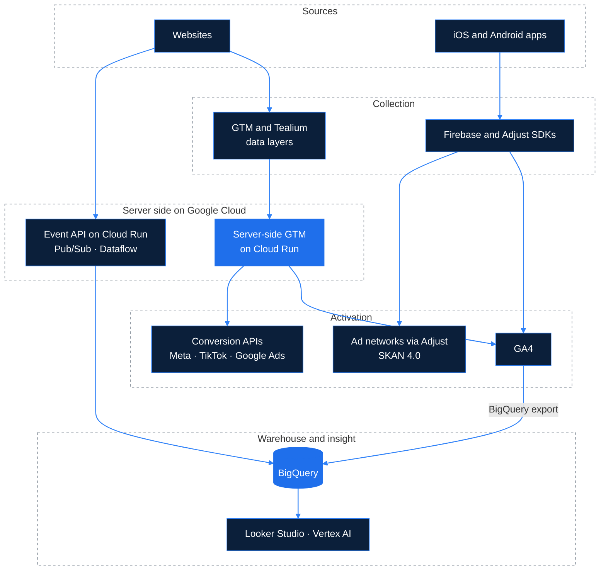
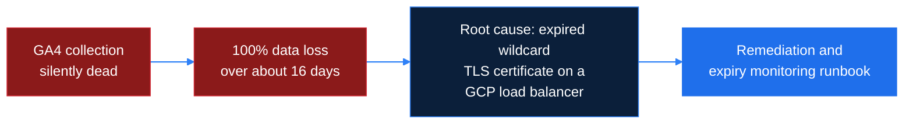
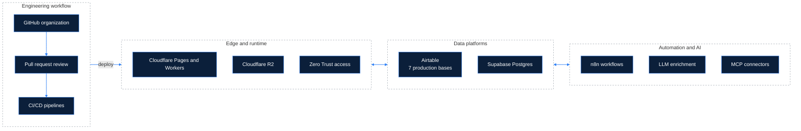
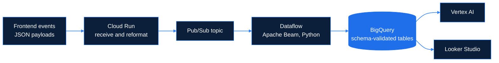
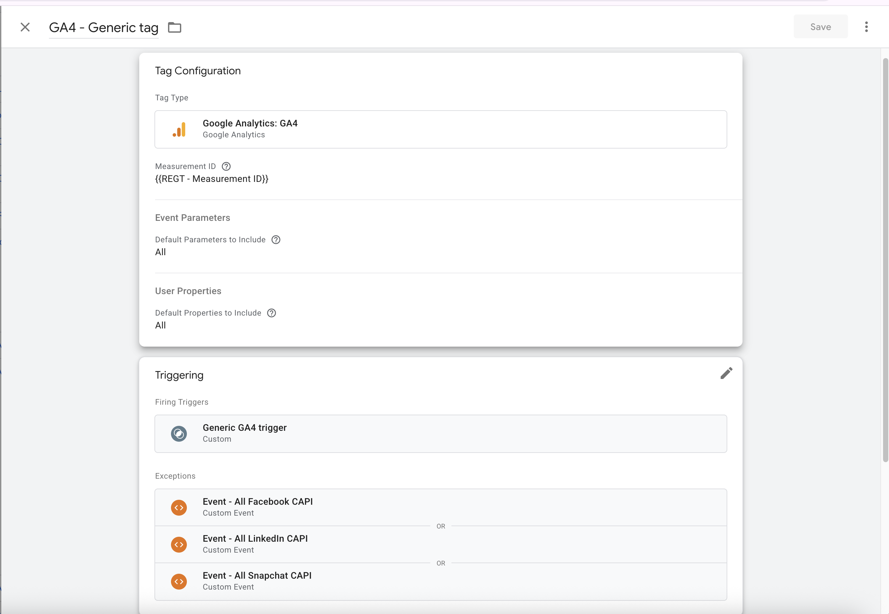
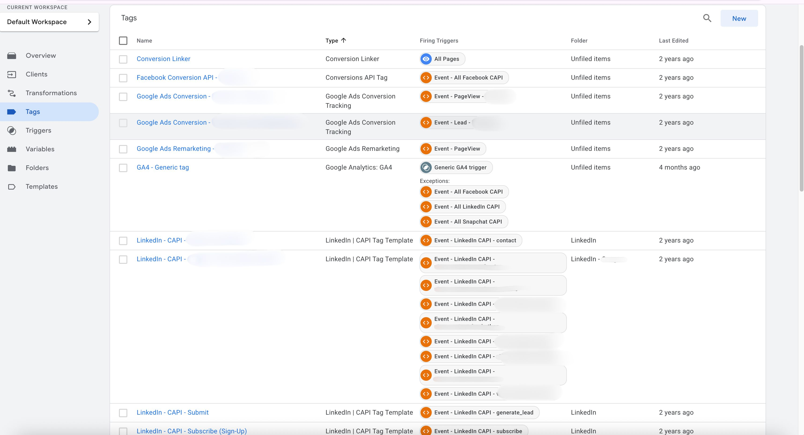
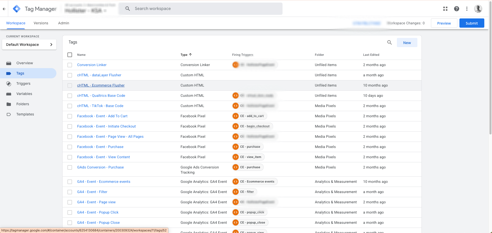
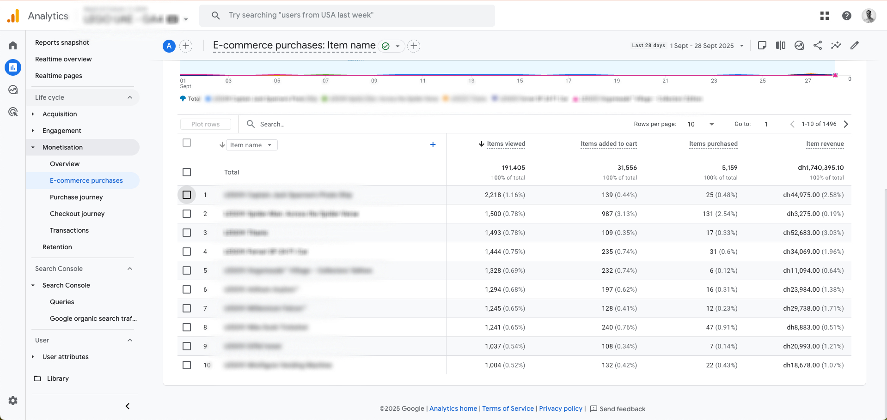

<!--
  GitHub profile README, updated October 2026.
  The GitHub Activity section near the bottom is hidden until you add your GitHub username (see the note there).
-->

  

  

  
  
  
  

  

## About

I build measurement and data infrastructure that teams can trust. As a **Data & Analytics Consultant at Merkle (dentsu)**, I design end-to-end tracking for enterprise clients across web and mobile: data layers, server-side tagging, Conversion APIs, mobile attribution, BigQuery pipelines, and the dashboards on top. I've delivered this for **50+ enterprise clients**, with setups of up to **200 tags per property**.

Since **April 2026** I've also owned the technical infrastructure at **The Reel Recipe** as Innovation Manager (tech lead), running the stack, deployments, CI/CD, and a 5-person tech team. As co-founder and CTO of **Rewired**, I lead the architecture behind Reivo, Click, and Rawaj.

<table>
  <tr>
    <td width="33%" valign="top">
      <b>Merkle (dentsu)</b> 
      Data &amp; Analytics Consultant
        
      Measurement and data engineering for enterprise clients: data layers, server-side tagging, Conversion APIs, mobile attribution, and BigQuery.
        
      &nbsp;
      &nbsp;
      &nbsp;
      &nbsp;
      
    </td>
    <td width="33%" valign="top">
      <b>The Reel Recipe</b> 
      Innovation Manager (tech lead) · since April 2026
        
      Own the technical infrastructure, deployments, and CI/CD, and lead a 5-person tech team.
        
      &nbsp;
      &nbsp;
      &nbsp;
      &nbsp;
      
    </td>
    <td width="33%" valign="top">
      <b>Rewired</b> 
      Co-founder &amp; CTO
        
      Architecture and engineering for three products: Reivo, Click, and Rawaj.
        
      &nbsp;
      &nbsp;
      
    </td>
  </tr>
</table>

## Impact at a Glance

<table>
  <tr><th colspan="4" align="left">Measurement</th></tr>
  <tr>
    <td align="center" width="25%"><h3>50+</h3>enterprise clients with end-to-end tracking</td>
    <td align="center" width="25%"><h3>50+</h3>server-side Conversion API integrations</td>
    <td align="center" width="25%"><h3>2–5%</h3>cross-platform discrepancy after server-side tracking</td>
    <td align="center" width="25%"><h3>10+</h3>tagging audits, 50+ issues found in each</td>
  </tr>
  <tr><th colspan="4" align="left">Data engineering and diagnostics</th></tr>
  <tr>
    <td align="center"><h3>7</h3>GA4 properties reconciled across 4 Shopify stores</td>
    <td align="center"><h3>319</h3>purchases analyzed to isolate lost attribution</td>
    <td align="center"><h3>16 days</h3>of lost data traced to an expired TLS certificate</td>
    <td align="center"><h3>10+ hrs</h3>saved per project through GTM and GA4 API automation</td>
  </tr>
  <tr><th colspan="4" align="left">Infrastructure and leadership</th></tr>
  <tr>
    <td align="center"><h3>5</h3>people on the tech team I lead</td>
    <td align="center"><h3>7</h3>production Airtable bases in the stack I run</td>
    <td align="center"><h3>3</h3>products built at Rewired</td>
    <td align="center"><h3>24</h3>MCP tools that let AI agents work in customer data</td>
  </tr>
</table>
Client names are withheld. Figures come from production data, audits, and delivered work.

## Measurement and Data Architecture

The reference architecture behind my measurement work, from the first event to the warehouse. Every layer below is something I've implemented, in client production environments or in my own GCP projects.

```mermaid
flowchart TB
    subgraph S1["Sources"]
        WEB["Websites"]
        APP["iOS and Android apps"]
    end
    subgraph S2["Collection"]
        TMS["GTM and Tealium<br/>data layers"]
        SDK["Firebase and Adjust SDKs"]
    end
    subgraph S3["Server side on Google Cloud"]
        SGTM["Server-side GTM<br/>on Cloud Run"]
        STREAM["Event API on Cloud Run<br/>Pub/Sub · Dataflow"]
    end
    subgraph S4["Activation"]
        GA4["GA4"]
        CAPI["Conversion APIs<br/>Meta · TikTok · Google Ads"]
        SKAN["Ad networks via Adjust<br/>SKAN 4.0"]
    end
    subgraph S5["Warehouse and insight"]
        BQ[("BigQuery")]
        BI["Looker Studio · Vertex AI"]
    end
    WEB --> TMS
    WEB ---> STREAM
    APP --> SDK
    TMS --> SGTM
    SGTM --> GA4
    SGTM --> CAPI
    SDK --> GA4
    SDK ---> SKAN
    GA4 -->|"BigQuery export"| BQ
    STREAM --> BQ
    BQ --> BI
    classDef default fill:#0B1F3A,stroke:#2F81F7,stroke-width:1px,color:#FFFFFF
    classDef key fill:#1F6FEB,stroke:#1F6FEB,stroke-width:1px,color:#FFFFFF
    class SGTM,BQ key
    style S1 fill:none,stroke:#8B949E,stroke-dasharray:4 4
    style S2 fill:none,stroke:#8B949E,stroke-dasharray:4 4
    style S3 fill:none,stroke:#8B949E,stroke-dasharray:4 4
    style S4 fill:none,stroke:#8B949E,stroke-dasharray:4 4
    style S5 fill:none,stroke:#8B949E,stroke-dasharray:4 4
    linkStyle default stroke:#2F81F7,stroke-width:1.5px
```

<table>
  <tr>
    <th align="center">Sources</th>
    <th align="center">Collection</th>
    <th align="center">Server side</th>
    <th align="center">Activation</th>
    <th align="center">Warehouse and insight</th>
  </tr>
  <tr>
    <td align="center">
      &nbsp;
      &nbsp;
      
    </td>
    <td align="center">
      &nbsp;
      &nbsp;
      
    </td>
    <td align="center">
      &nbsp;
      &nbsp;
      
    </td>
    <td align="center">
      &nbsp;
      &nbsp;
      &nbsp;
      
    </td>
    <td align="center">
      &nbsp;
      
    </td>
  </tr>
</table>

## Measurement and Data Engineering · Merkle (dentsu)

  
  
  
  
  
  
  
  

| Engagement | Challenge | What I delivered |
|:--|:--|:--|
| **GCC health insurer** iOS and Android   | Greenfield mobile measurement with Adjust | Led a 4-person delivery: mapped 7 media suppliers, designed a **6-bit SKAN 4.0 conversion schema across 25 events**, and linked every partner. Corrected the setup order so supplier and SDK work run in parallel, and caught a proposed schedule that overstated the timeline by about 50% |
| **UAE theme park group** cross-domain booking  | Purchases not credited to the campaigns that drove them | Analyzed **319 purchases** with a controlled test matrix that ruled out 6 suspected causes, proved cross-domain tracking works, and isolated the real mechanisms: campaigns dropped mid-session and UTM-tagged internal links restarting sessions. Also found staging sites writing into production |
| **UAE theme park group** ticket booking flow   | No ecommerce data | GA4 ecommerce tracking for 6 events on a Drupal booking flow, with a **Playwright QA spec that blocks analytics beacons** so testing never pollutes production data |
| **Multi-market retailer** 4 Shopify stores, 7 GA4 properties   | UAE showed 28% more GA4 sessions than Shopify, and an internal memo called it unavoidable | Proved checkout stitching works (identical client and session IDs). The first fix removed about a third of the UAE excess while KSA and Kuwait stayed within 4% of Shopify, rolled out one store at a time |
| **Large public sector site** server-side GTM   | GA4 collection silently dead | Traced **100% data loss over about 16 days** to an expired wildcard TLS certificate on a GCP load balancer, and delivered a remediation and expiry monitoring runbook |
| **GA4 governance**  | 41 custom definitions with unknown health | Audit script that classifies each one as dead, stale, quality issue, or healthy |
| **Car marketplace**   | Unreliable GA4 data | Found dev and staging traffic in the production property and hard-coded tags outside GTM, with fixes ordered to prevent double counting |
| **Corporate holding group**    | No view of real site navigation | GA4 → BigQuery → Looker dashboard covering navigation, CTA, card, and PDF clicks |

```mermaid
flowchart LR
    A["GA4 collection<br/>silently dead"] --> B["100% data loss<br/>over about 16 days"]
    B --> C["Root cause: expired wildcard<br/>TLS certificate on a<br/>GCP load balancer"]
    C --> D["Remediation and<br/>expiry monitoring runbook"]
    classDef default fill:#0B1F3A,stroke:#2F81F7,stroke-width:1px,color:#FFFFFF
    classDef alert fill:#8B1A1A,stroke:#CF222E,stroke-width:1px,color:#FFFFFF
    classDef resolved fill:#1F6FEB,stroke:#1F6FEB,stroke-width:1px,color:#FFFFFF
    class A,B alert
    class D resolved
    linkStyle default stroke:#2F81F7,stroke-width:1.5px
```

Incident trace from the public sector engagement, from silent failure to root cause and runbook.

## Infrastructure and Engineering Leadership · The Reel Recipe

Innovation Manager (tech lead) · since April 2026

  
  
  
  
  
  

<table>
  <tr>
    <td width="50%" valign="top">
      &nbsp;
      &nbsp;
      &nbsp;
      
        
      <b>Infrastructure ownership</b>
        
      I own the company's full technical stack: Airtable (7 production bases), Cloudflare (Pages, Workers, R2, Zero Trust, and Cloudflare for SaaS), Supabase, n8n, and GitHub, including access governance under Zero Trust.
    </td>
    <td width="50%" valign="top">
      &nbsp;
      &nbsp;
      
        
      <b>Deployments and CI/CD</b>
        
      I deploy and run multiple projects in production, from a client review portal on Cloudflare Workers behind Zero Trust login to multi-tenant SaaS products, shipped through CI/CD pipelines.
    </td>
  </tr>
  <tr>
    <td valign="top">
      &nbsp;
      
        
      <b>Team leadership and collaboration</b>
        
      I lead a 5-person tech team. Work runs as tickets and sprints, code lives in a company GitHub organization, and changes ship through pull request review instead of straight to main. New team members ship a first solo task within 5 working days.
    </td>
    <td valign="top">
      &nbsp;
      &nbsp;
      &nbsp;
      
        
      <b>Automation and AI workflows</b>
        
      n8n pipelines with transcription and LLM enrichment, MCP connectors that let AI tools query internal data, and weekly Meta and TikTok reporting automated into Looker Studio.
    </td>
  </tr>
</table>

```mermaid
flowchart LR
    subgraph ENG["Engineering workflow"]
        direction TB
        GH["GitHub organization"] --> PR["Pull request review"] --> CI["CI/CD pipelines"]
    end
    subgraph RUN["Edge and runtime"]
        CF["Cloudflare Pages and Workers"]
        R2["Cloudflare R2"]
        ZT["Zero Trust access"]
    end
    subgraph DATA["Data platforms"]
        AT["Airtable<br/>7 production bases"]
        SB["Supabase Postgres"]
    end
    subgraph AUTO["Automation and AI"]
        N8N["n8n workflows"]
        LLM["LLM enrichment"]
        MCP["MCP connectors"]
    end
    ENG -->|"deploy"| RUN
    RUN <--> DATA
    DATA <--> AUTO
    classDef default fill:#0B1F3A,stroke:#2F81F7,stroke-width:1px,color:#FFFFFF
    style ENG fill:none,stroke:#8B949E,stroke-dasharray:4 4
    style RUN fill:none,stroke:#8B949E,stroke-dasharray:4 4
    style DATA fill:none,stroke:#8B949E,stroke-dasharray:4 4
    style AUTO fill:none,stroke:#8B949E,stroke-dasharray:4 4
    linkStyle default stroke:#2F81F7,stroke-width:1.5px
```

## Products and Architecture · Rewired

  
  
  
  
  
  

As co-founder and CTO of **Rewired**, I lead architecture and engineering for Reivo, Click, and Rawaj. The table also covers other systems I've designed.

| Product | What it is | Architecture and proof |
|:--|:--|:--|
| **Reivo** formerly Revio   | Multi-tenant client review SaaS for creative agencies | 8 roles enforced by Postgres row level security, encrypted HLS video on Cloudflare R2, true Arabic RTL, 30 documented workflows, and **194 test cases across 14 modules**. The launch video produced **100 leads** |
| **Click**  | Relational database product with Airtable import | Ships an MCP server with **24 tools** behind OAuth 2.1, so AI agents can work in customer tables |
| **Rawaj** | Marketplace connecting brands with vetted creators, editors, and UGC talent | Engineering spec of **24 phases, about 200 features, and about 300 named tests** written before the build |
| **ERP hosting** | Open source ERP deployed on the client's own cloud | Provider decision matrix priced at 10, 50, and 200 users. Standardized on Frappe/ERPNext |
| **App tracking debugger**  | My own tool for iOS app tracking QA | Built after commercial proxy tools blocked audits with session limits and paywalls |
| **ID verification** | One-time national ID and face check for a mobile app, storing no identity data | Designed at about **\$0.044 per user** worst case, under a \$0.05 cap that the first vendor exceeded about 6 times |

## Selected Projects

### Real-Time Event Streaming Pipeline
Personal GCP project

  &nbsp;&nbsp;
  &nbsp;&nbsp;
  &nbsp;&nbsp;
  &nbsp;&nbsp;
  &nbsp;&nbsp;
  &nbsp;&nbsp;
  

```mermaid
flowchart LR
    FE["Frontend events<br/>JSON payloads"] --> CR["Cloud Run<br/>receive and reformat"]
    CR --> PS["Pub/Sub topic"]
    PS --> DF["Dataflow<br/>Apache Beam, Python"]
    DF --> BQ[("BigQuery<br/>schema-validated tables")]
    BQ --> VX["Vertex AI"]
    BQ --> LS["Looker Studio"]
    classDef default fill:#0B1F3A,stroke:#2F81F7,stroke-width:1px,color:#FFFFFF
    classDef key fill:#1F6FEB,stroke:#1F6FEB,stroke-width:1px,color:#FFFFFF
    class BQ key
    linkStyle default stroke:#2F81F7,stroke-width:1.5px
```

| Challenge | Solution | Result |
|-----------|----------|---------|
| Need for real-time web analytics beyond GA4 | Cloud Run backend → Pub/Sub → Dataflow ETL → BigQuery | End-to-end streaming pipeline with sub-second latency |
| Raw data needed for ML model training | Apache Beam pipeline writing structured events to BigQuery | Data ready for Vertex AI models and Looker dashboards |
| Cost-efficient architecture at scale | Infrastructure designed around projected event volume | Optimized GCP spend with serverless components |

<b>Technical implementation details</b>

 

- **Cloud Run Backend**: Receives and reformats JSON event payloads from the frontend
- **Pub/Sub Topic**: Publishes processed events as messages for downstream consumers
- **Dataflow + Apache Beam (Python)**: Streaming ETL pipeline that parses, transforms, and loads events into BigQuery
- **BigQuery**: Schema-validated tables serving Vertex AI and Looker Studio

### Server-Side Tagging and Conversion APIs

  &nbsp;&nbsp;
  &nbsp;&nbsp;
  &nbsp;&nbsp;
  &nbsp;&nbsp;
  &nbsp;&nbsp;
  

<table>
  <tr>
    <td width="50%" align="center">
      
       Server-side Google Tag Manager
    </td>
    <td width="50%" align="center">
      
       Conversion API (CAPI) implementation
    </td>
  </tr>
</table>

| Challenge | Solution | Result |
|-----------|----------|---------|
| Data loss from ad blockers & cookie limitations | GTM server-side tagging on a Cloud Run serverless instance | Mitigated ad blocker impact and browser constraints |
| Discrepancy between GA4, ad platforms & backend | First-party context tracking to bypass browser constraints | Reduced discrepancies to 2–5% across platforms |
| Inaccurate conversion data to ad platforms | Conversion API (CAPI) for direct server-to-server tracking | More accurate conversion data powering ad optimization |

<b>Technical implementation details</b>

 

- **GTM Server-Side Tagging**: Cloud Run serverless instance for first-party data collection
- **50+ CAPI Integrations**: Meta, TikTok, and Google Ads server-side conversion APIs deployed across clients
- **500+ Pixels Managed**: Client-side pixel deployments orchestrated through GTM
- **First-Party Context Tracking**: Bypassing ad blockers and browser privacy constraints

### GTM and GA4 Configuration Automation Platform
Internal tool, adopted across the analytics team

  &nbsp;&nbsp;
  

| Challenge | Solution | Result |
|-----------|----------|---------|
| Manual GTM/GA4 setup was time-consuming and error-prone | Web app integrating the GTM and GA4 Admin APIs for automated configuration | 10+ configurations automated, saving 10+ hours per project |
| No standardized deployment workflow across the team | Pre-built templates and CSV upload input methods | Tool adopted team-wide for consistent, repeatable deployments |
| API quota limits threatened reliability | Built-in rate limiting logic for batch operations | Stable, reliable automation within API constraints |

<b>Technical implementation details</b>

 

- **GTM API**: Automates tag, trigger, and variable configuration at scale
- **GA4 Admin API**: Creates custom dimensions and metrics dynamically from user input
- **Input Methods**: CSV upload and pre-built template options for flexible workflows
- **Rate Limiting**: Quota-safe batch processing for reliable large-scale deployments

### E-commerce Analytics Implementation
Client: major online retailer

  &nbsp;&nbsp;
  &nbsp;&nbsp;
  &nbsp;&nbsp;
  &nbsp;&nbsp;
  

<table>
  <tr>
    <td width="50%" align="center">
      
       Google Tag Manager configurations
    </td>
    <td width="50%" align="center">
      
       Google Analytics 4 "E-commerce Purchases"
    </td>
  </tr>
</table>

| Challenge | Solution | Result |
|-----------|----------|---------|
| No visibility into e-commerce funnel & user journey | GTM & DataLayer implementation for GA4 tracking | Full e-commerce funnel visibility with drop-off analysis |
| No item performance tracking | Enhanced e-commerce events with product-level parameters | Item-level insights across ID, name, category, price & quantity |
| No conversion tracking in Meta ad platforms | Media pixels via GTM for cross-platform optimization | Conversions sent to ad platforms to optimize ROAS |

<b>Technical implementation details</b>

 

- **GTM & DataLayer Setup**: Comprehensive e-commerce event tracking implementation
- **GA4 E-commerce Events**: `purchase`, `add_to_cart`, `begin_checkout`, `view_item` with full item-level parameters
- **Item-Level Tracking**: Product ID, name, category, price, quantity parameters
- **Media Pixels Integration**: Facebook Pixel, TikTok Pixel, Google Ads via GTM

### Website Conversion Tracking
Client: lead vehicle dealership

  &nbsp;&nbsp;
  &nbsp;&nbsp;
  

<table>
  <tr>
    <td width="33%" align="center">
      
       Google Tag Manager configurations
    </td>
    <td width="33%" align="center">
      
       Google Analytics 4 dashboard
    </td>
    <td width="33%" align="center">
      
       Pixels implementation
    </td>
  </tr>
</table>

| Challenge | Solution | Result |
|-----------|----------|---------|
| High form abandonment rate & no lead tracking | GTM & DataLayer for form events & user journey optimization | Visibility on drop-off points across every form step |
| Incorrect marketing attributions | Custom channel grouping configurations in GA4 | Clear performance breakdown across all marketing channels |
| No conversion tracking in TikTok ad platforms | Media pixels via GTM for campaign optimization | Conversions sent to TikTok to optimize ad spend |

<b>Technical implementation details</b>

 

- **GTM & DataLayer Implementation**: Form interaction and submission event tracking
- **Form Events Tracking**: `form_start`, `form_submit`, `form_abandon` with field-level data
- **User Journey Optimization**: Step-by-step form analytics and abandonment points
- **GA4 Channel Groups Configuration**: Custom channel grouping for accurate attribution
- **Media Pixel Integrations**: Conversion tracking and campaign optimization via GTM

## Measurement Methodology

<b>Phase 1: Discovery and strategy</b>

 

- **Current Tracking Setup Assessment**: Complete audit of existing tracking, with 10+ audits delivered, each identifying 50+ issues
- **Gap Analysis**: Identification of missing data points across web and app
- **KPI Mapping**: Alignment with business objectives
- **Technical Specification**: Detailed implementation plan
- **Timeline & Milestones**: Clear project roadmap

<b>Phase 2: Implementation</b>

 

- **Tag Management Setup**: GTM/Tealium configuration across 50+ enterprise properties
- **Data Layer Development**: Custom event tracking for web and mobile
- **Analytics Configuration**: GA4 and Firebase SDK setup, BigQuery export pipelines
- **App Measurement**: Firebase SDK integration for iOS and Android with event schema design
- **Mobile Attribution**: Adjust setup, SKAN 4.0 conversion schema design, and media partner linking
- **DataLayer Implementation Guide**: Auto-generated developer guides via Apps Script automation

<b>Phase 3: Testing and validation</b>

 

- **Data Accuracy Testing**: Tracking validations and QA reports
- **Automated QA**: Playwright specs that block analytics beacons so testing never pollutes production data
- **Cross-Browser Testing**: Compatibility across devices and platforms
- **Discrepancy Analysis**: Reducing gaps between GA4, ad platforms, and backend data to 2–5%
- **Team Training**: Team enablement sessions

<b>Phase 4: Optimization and support</b>

 

- **Performance Monitoring**: Ongoing data quality checks
- **Governance Audits**: Scripts that classify GA4 custom definitions as dead, stale, quality issue, or healthy
- **Server-Side Scaling**: Cloud Run infrastructure tuned to event volume
- **Team Training**: Skill transfer and best practices

## Technologies and Tools

<b>Measurement and tag management</b>

 

  &nbsp;&nbsp;&nbsp;&nbsp;
  &nbsp;&nbsp;&nbsp;&nbsp;
  &nbsp;&nbsp;&nbsp;&nbsp;
  &nbsp;&nbsp;&nbsp;&nbsp;
  &nbsp;&nbsp;&nbsp;&nbsp;
  
    
  &nbsp;&nbsp;&nbsp;&nbsp;
  &nbsp;&nbsp;&nbsp;&nbsp;
  &nbsp;&nbsp;&nbsp;&nbsp;
  &nbsp;&nbsp;&nbsp;&nbsp;
  &nbsp;&nbsp;&nbsp;&nbsp;
  &nbsp;&nbsp;&nbsp;&nbsp;
  
    
  
  

 

| Tool | What I use it for |
|------|-------------------|
| **Google Tag Manager** | Web and server-side containers, data layer design, custom templates, conversion setup |
| **Tealium IQ** | Enterprise tag management, data layer optimization, audience building |
| **Google Analytics 4** | E-commerce and cross-domain tracking, custom definitions, governance audits |
| **Firebase Analytics SDK** | iOS and Android analytics, user properties, BigQuery export |
| **Adjust** | Mobile attribution, SKAN 4.0 conversion schemas, media partner linking |
| **Meta, TikTok, Google Ads** | Pixels and server-side Conversion APIs |
| **Shopify and Drupal** | Multi-store GA4 reconciliation, checkout stitching, and booking-flow ecommerce tracking |
| **Hotjar** | Heatmaps, session recordings, conversion funnel analysis |
| **Google Search Console** | SEO performance tracking, search analytics |

<b>Data engineering and cloud</b>

 

  &nbsp;&nbsp;&nbsp;&nbsp;
  &nbsp;&nbsp;&nbsp;&nbsp;
  &nbsp;&nbsp;&nbsp;&nbsp;
  
    
  &nbsp;&nbsp;&nbsp;&nbsp;
  &nbsp;&nbsp;&nbsp;&nbsp;
  

 

| Service | What I use it for |
|---------|-------------------|
| **BigQuery** | Raw data warehousing, cross-platform analytics, GA4 and Firebase export analysis |
| **Cloud Run** | Serverless server-side tagging and event ingestion backends |
| **Pub/Sub** | Real-time event streaming from web and app sources |
| **Dataflow + Apache Beam** | Python streaming ETL into schema-validated tables |
| **Looker Studio** | Automated reporting and BigQuery dashboards |

<b>Infrastructure and DevOps</b>

 

  &nbsp;&nbsp;&nbsp;&nbsp;
  &nbsp;&nbsp;&nbsp;&nbsp;
  &nbsp;&nbsp;&nbsp;&nbsp;
  &nbsp;&nbsp;&nbsp;&nbsp;
  &nbsp;&nbsp;&nbsp;&nbsp;
  &nbsp;&nbsp;&nbsp;&nbsp;
  

 

| Platform | What I use it for |
|----------|-------------------|
| **Cloudflare** | Pages, Workers, R2, Zero Trust, and Cloudflare for SaaS |
| **Supabase and Postgres** | Product backends with row level security |
| **Airtable** | 7 production bases: Content, People & Culture, Business Development, Finance, Innovation, Performance, UGC |
| **Git and GitHub** | Company organization, pull request review, CI/CD pipelines |

<b>Automation and AI</b>

 

  &nbsp;&nbsp;&nbsp;&nbsp;
  &nbsp;&nbsp;&nbsp;&nbsp;
  &nbsp;&nbsp;&nbsp;&nbsp;
  
    
  
  

 

| Tool | What I use it for |
|------|-------------------|
| **n8n** | Workflow automation and AI pipelines with transcription and LLM enrichment |
| **Claude Code and MCP** | AI-assisted development and MCP servers that let AI agents work inside products |
| **Google Apps Script** | Reporting automation and auto-generated data layer implementation guides |
| **FFmpeg** | Media processing inside the n8n content pipeline |
| **GTM and GA4 APIs** | Automated configuration at scale with quota-safe batching |
| **Playwright** | Analytics QA that blocks beacons so tests never pollute production |

<b>Frontend and scripting</b>

 

  &nbsp;&nbsp;&nbsp;&nbsp;
  &nbsp;&nbsp;&nbsp;&nbsp;
  

**Skills:** Custom event handling, DOM manipulation, API integrations, performance optimization, Google Apps Script, Python

**Impact:** Built 3 automation tools and 1 reusable GTM template that collectively save **10+ hours per project**, adopted team-wide for standardized deployments

<!--
  GITHUB ACTIVITY IS HIDDEN.
  To show it: replace every YOUR_GITHUB_USERNAME in the block below with your GitHub handle,
  then delete the line that says START HIDDEN and the line that says END HIDDEN.
-->

<!-- START HIDDEN

## GitHub Activity

  <picture>
    <source media="(prefers-color-scheme: dark)" srcset="https://github-stats-extended.vercel.app/api?username=YOUR_GITHUB_USERNAME&show_icons=true&hide_border=true&bg_color=0D1117&title_color=2F81F7&icon_color=2F81F7&text_color=C9D1D9"/>
    
  </picture>
  <picture>
    <source media="(prefers-color-scheme: dark)" srcset="https://github-stats-extended.vercel.app/api/top-langs/?username=YOUR_GITHUB_USERNAME&layout=compact&hide_border=true&bg_color=0D1117&title_color=2F81F7&text_color=C9D1D9"/>
    
  </picture>
   
  <picture>
    <source media="(prefers-color-scheme: dark)" srcset="https://github-readme-activity-graph.vercel.app/graph?username=YOUR_GITHUB_USERNAME&bg_color=0D1117&color=C9D1D9&title_color=2F81F7&line=2F81F7&point=FFFFFF&area=true&area_color=2F81F7&hide_border=true"/>
    
  </picture>

END HIDDEN -->

## Credentials and Certifications

|  |  |  |  |  |
|:---:|:---:|:---:|:---:|:---:|
| **Google Analytics 4 Certified** | **Google Cloud Associate Data Practitioner** | **Tealium IQ Certified** | **Hotjar Certified** | **SEO Certified** |

 

*Select any badge to view the full certificate*

## Let's Connect

  
  &nbsp;&nbsp;&nbsp;
  

  

